# Mermaid Diagram Examples

- [Flowchart](#flowchart)
- [Sequence Diagram](#sequence-diagram)
- [Class Diagram](#class-diagram)
- [State Diagram](#state-diagram)
- [Entity Relationship Diagram](#entity-relationship-diagram)
- [Gantt Chart](#gantt-chart)
- [Pie Chart](#pie-chart)
- [Git Graph](#git-graph)
- [Journey Map](#journey-map)
- [Mindmap](#mindmap)
- [Timeline](#timeline)
- [Quadrant Chart](#quadrant-chart)
- [Sankey Diagram](#sankey-diagram)
- [Block Diagram](#block-diagram)

## Flowchart

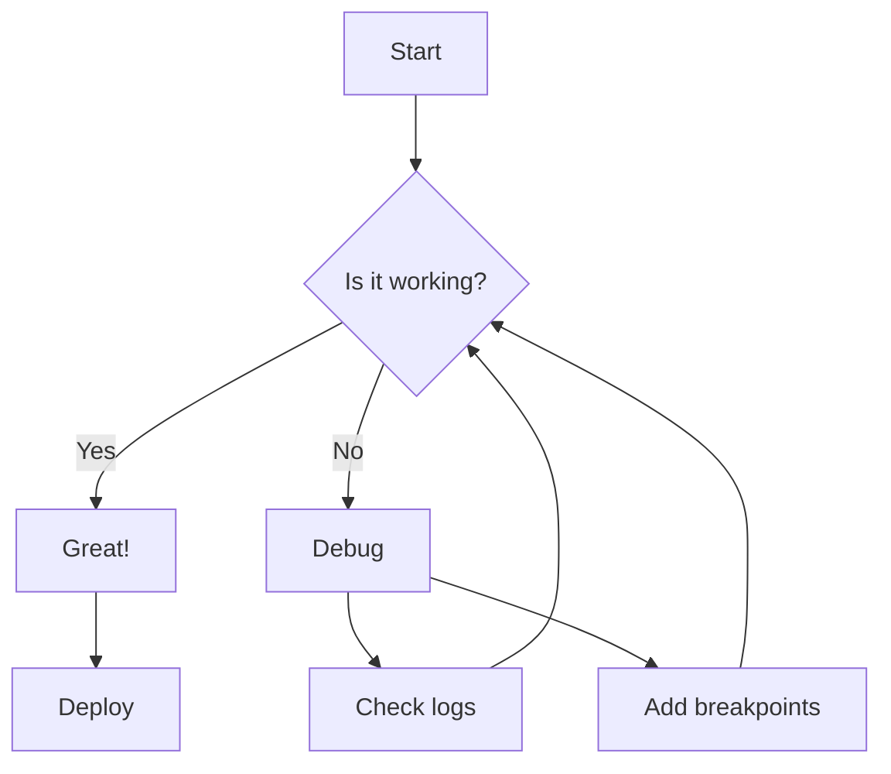

## Sequence Diagram

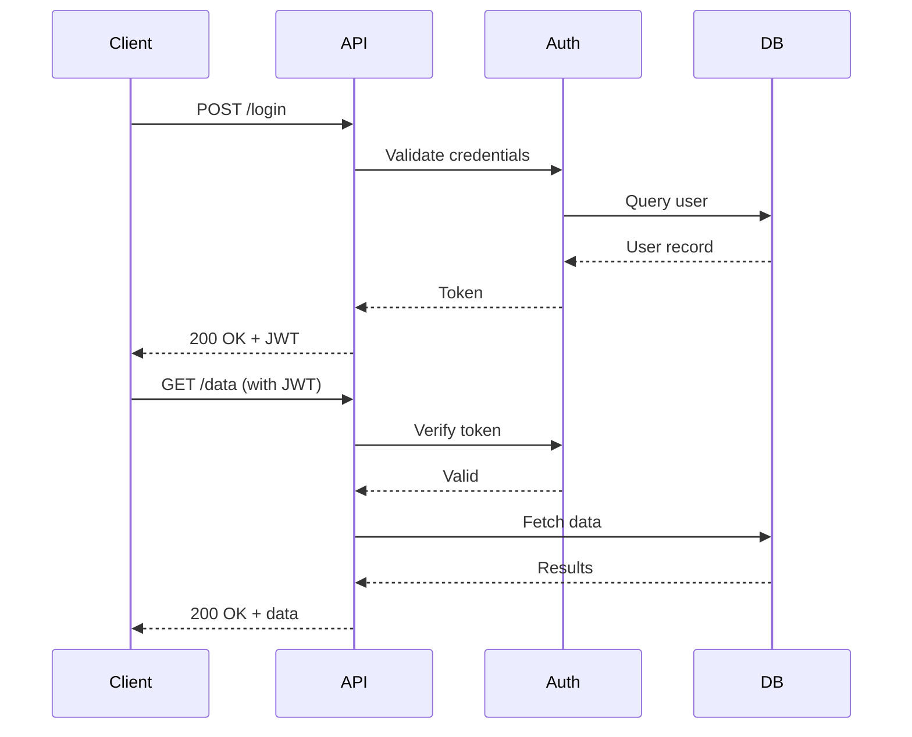

## Class Diagram

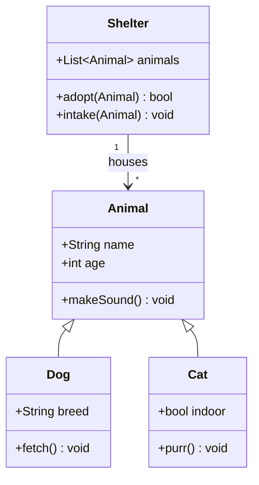

## State Diagram

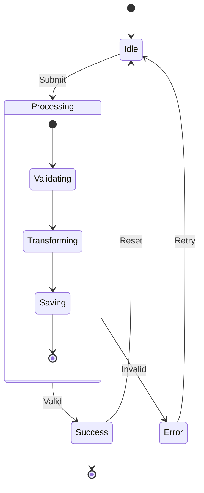

## Entity Relationship Diagram

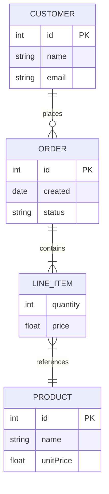

## Gantt Chart

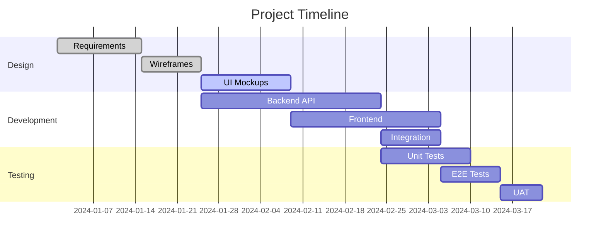

## Pie Chart

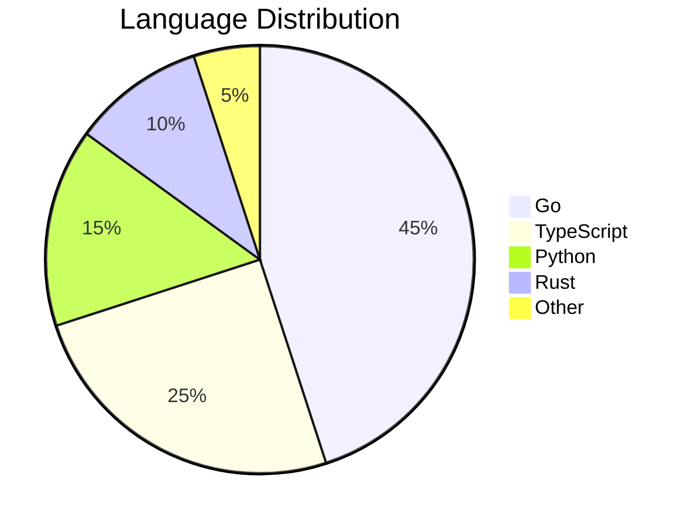

## Git Graph

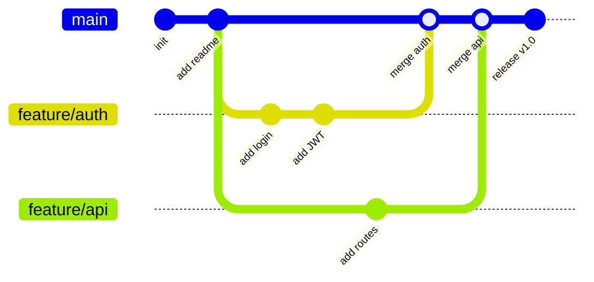

## Journey Map

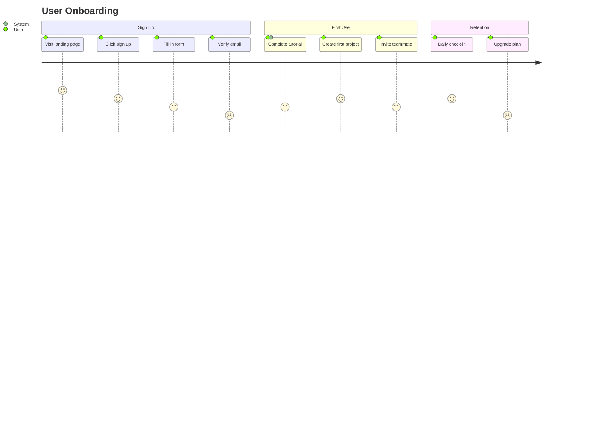

## Mindmap

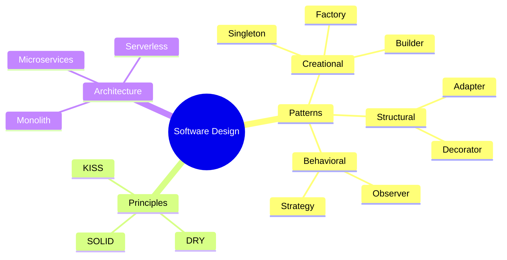

## Timeline

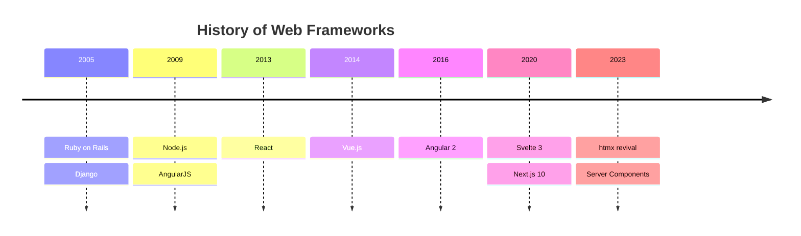

## Quadrant Chart

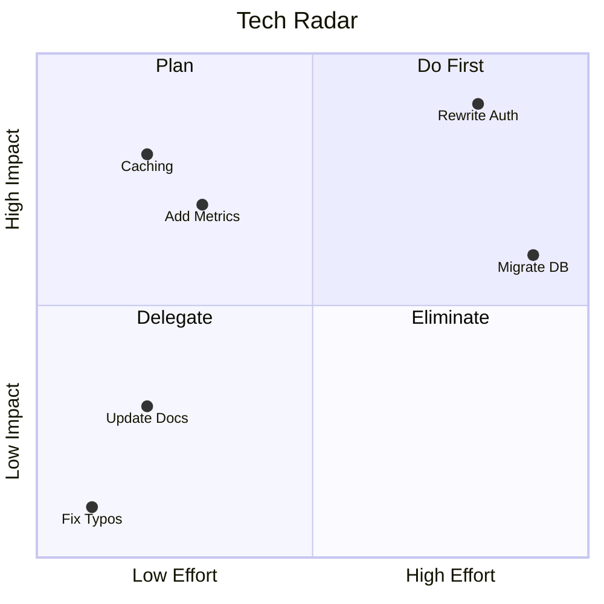

## Sankey Diagram

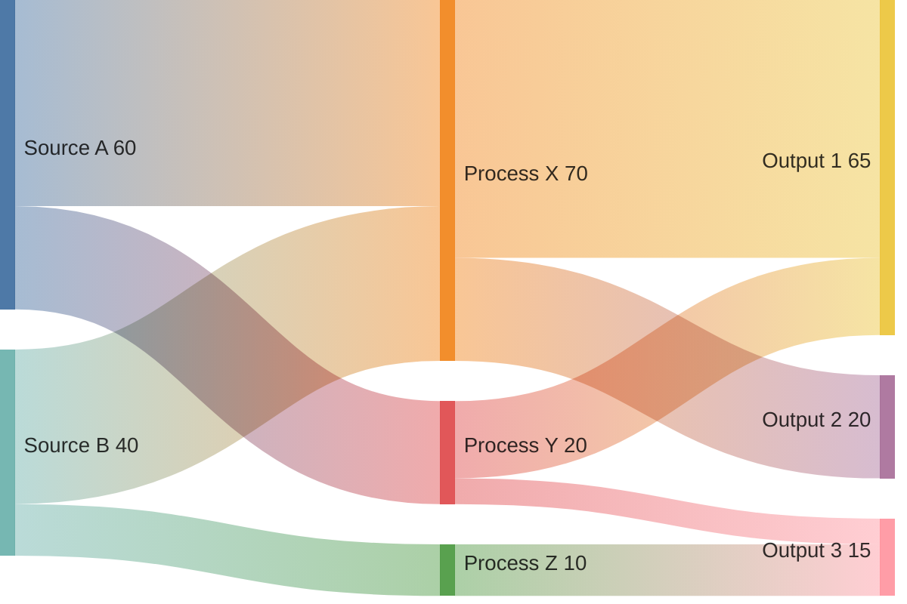

## Block Diagram

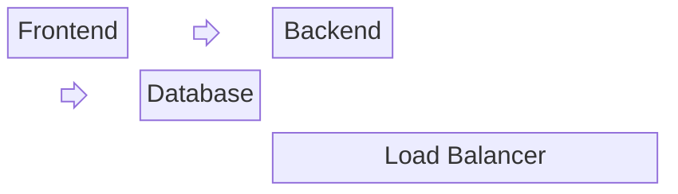
