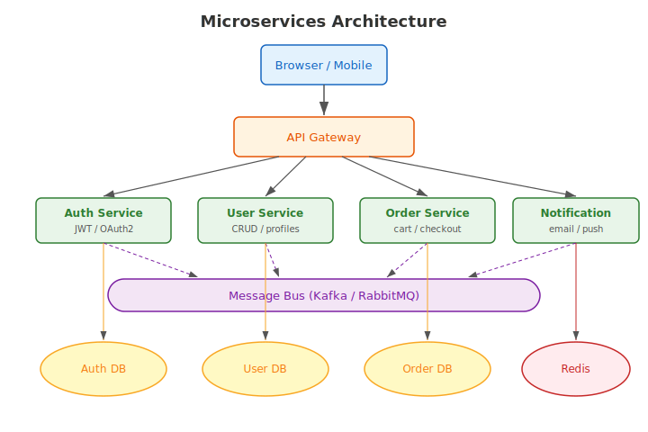
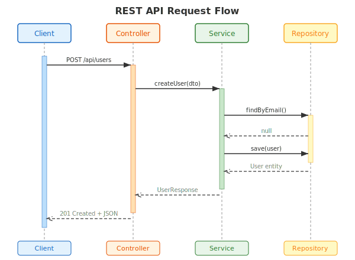
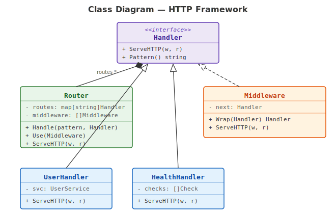
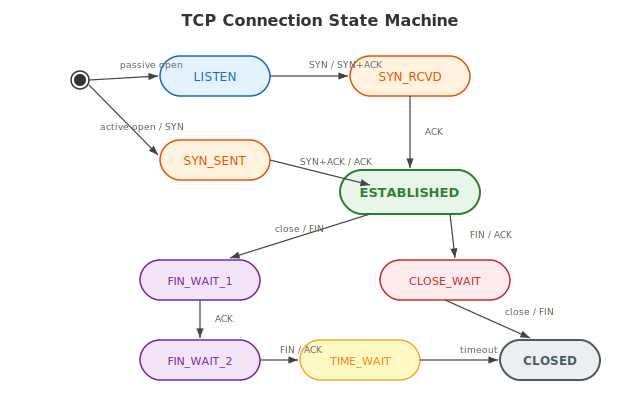
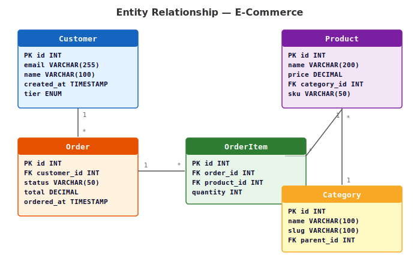
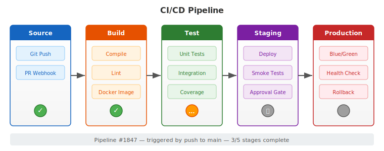
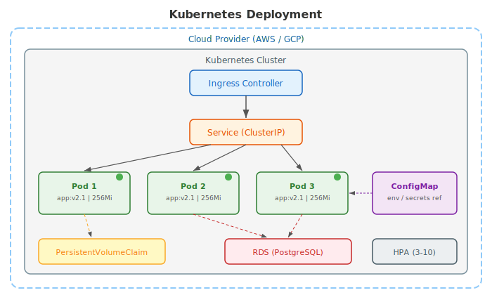
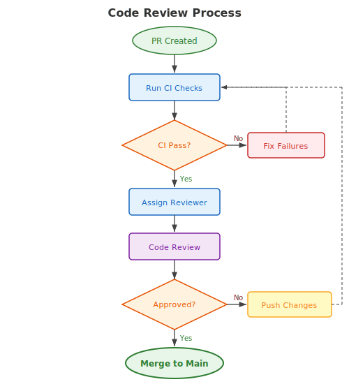
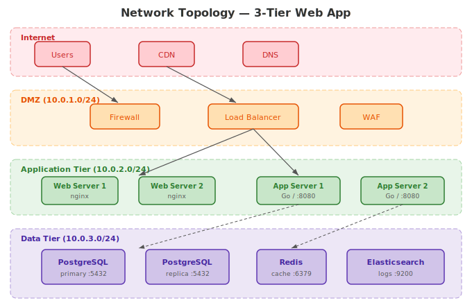

# SVG Diagram Examples

- [Microservices Architecture](#microservices-architecture)
- [Sequence Diagram](#sequence-diagram)
- [Class Diagram](#class-diagram)
- [State Machine](#state-machine)
- [Entity Relationship Diagram](#entity-relationship-diagram)
- [CI/CD Pipeline](#cicd-pipeline)
- [Kubernetes Deployment](#kubernetes-deployment)
- [Code Review Flowchart](#code-review-flowchart)
- [Network Topology](#network-topology)

## Microservices Architecture

A typical microservices layout with API gateway, service mesh, message bus, and data stores.

## Sequence Diagram

REST API request flow through controller, service, and repository layers.

## Class Diagram

HTTP framework class hierarchy with interfaces, composition, and inheritance.

## State Machine

TCP connection lifecycle showing all major states and transitions.

## Entity Relationship Diagram

E-commerce database schema with customers, orders, products, and categories.

## CI/CD Pipeline

Five-stage deployment pipeline from source through production with status indicators.

## Kubernetes Deployment

Container orchestration with ingress, services, pods, config, and persistent storage.

## Code Review Flowchart

Pull request review workflow with CI checks, reviewer assignment, and merge decision.

## Network Topology

Three-tier web application network with DMZ, application, and data tiers.

